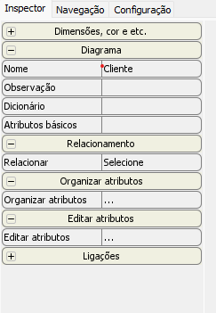
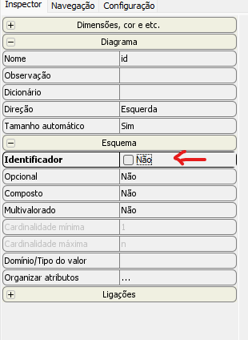
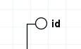
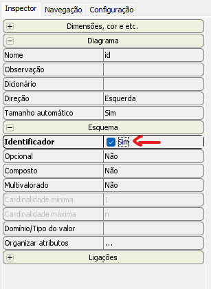
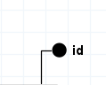
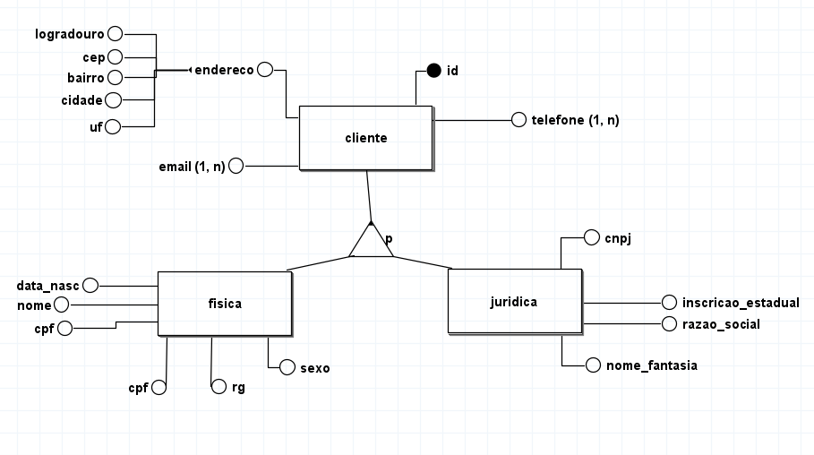

                                                                        Banco de Dados

- Estamos utilizando o brModelo para fazer a correção da atividade no modelo conceitual.
- Existe varios softwares para fazer isso, porem o brModelo é bem apropriado para usar no banco de dados.
- 
- Aonde esta escrito nome você poderá mudar o nome da entidade.
- Caso o atributo seja um identificador, basta clicar na caixinha de identificador e apertar na caixinha do não para mudar.
## No começo irá ficar desta forma
- 
- 

## Depois de apertar na caixa para "sim" irá ficar desta forma
- 
- 

## O que fazer se existir duas entidades com o mesmo nome?

- O certo a se fazer é uma especialização.
- existe dois modos de especialização que são chamadas de total e parcial.
- A Parcial fica com a maior parte dos dados repetitivos das entidades, aonde são colocados apenas alguns dados individuais nas entidades.
- A Total é quando fica com a menor parte dos dados, e são colocados todos os dados que não são iguais em cada entidade.

## EXEMPLO DE UMA ESPECIALIZAÇÃO
-
