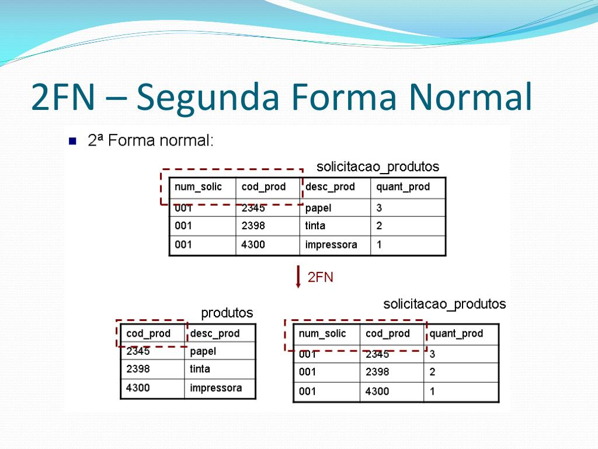
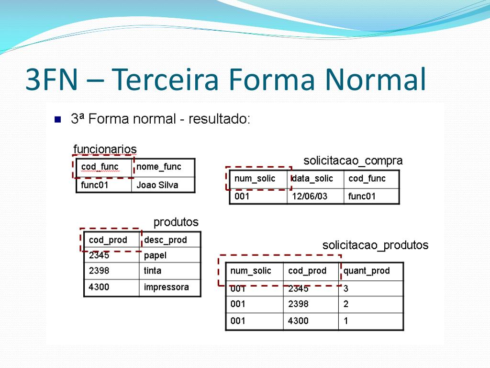

                                                                         Banco de Dados

## DER (Diagrama e Entidade de Relacionamento)
- DataBase -> É aonde eu vou criar a estrutura do banco de dados, é recomendado utilizar o nome do projeto no data base e a sigla "db"
ou separar utilizando underscore(underline), não adianta fazer o estilo camelCase, pois o data base vai deixar tudo minúsculo.
- ex: dbsenai, db_biblioteca

## Tabela
- É a entidade, cada uma deve ter um nome único somente para ela. Devemos colocar os atributos nela e selecionando tipo do atributo
- podemos identificar uma tabela utilizando "tbl" ou "tb".
- ex: tblcliente, tbl_fornecedores, tbproduto

## Campos 
- É os atributos, ele que recebe todos os elementos
- ex: campo: tblcliente -  nome, endereco* , cpf....

---

## Diferença de Datas
- 12/03/2026 -> É uma data? Não.
- 2026-03-12 -> É uma data? SIM, o banco de dados entende somente esse tipo de data

## Auto Incremente
- tipo de dado "integer"(inteiro) que o próprio banco de dados vai realizar em si mesmo.

## Chave Primaria
- Ela é o atributo que temos no banco que o valor jamais vai se repetir. ELA também pode otimizar a busca de informações e gera relacionamentos
- com outras entidades. Ela vai representer o ID

### REGRAS PARA IDENTIFICAR A CHAVE PRIMARIA
- 1° Campo único
- 2° Campos com tamanhos pequenos
- 3° Campo que nunca pode ser alterado
- 4° Campo que nunca seja do tipo texto
- 5° Campos que sejam preenchimentos obrigatórios 
- 6° Caso não haja um campo com essas características defina para o próprio BD crie e gerencie esse campo, usando o tipo de dados "Auto-Incremento"

## Chave Estrangeira
- Ela faz o relacionamento entre duas tabelas.
- Exemplo: o nosso trabalho da consultada, aonde havia as entidades pacientes e concultas.
- Uma chave primaria transforma-se em uma chave estrangeira em outra tabela para criar a interligação entre as mesmas.

## Existem 5FNs(chaves estrangeiras)
- Primeira Forma Normal (1FN);
- Segunda Forma Normal (2FN);
- Terceira Forma Normal (3FN);
- Quarta/Quinta é uma mistura das primeiras chaves

## Os procedimentos mais recomendados para aplicar as FNs

### Primeira Forma Normal(1FN)
- (A) identificar a chave primária da entidade;
- (B) Identificar o grupo repetitivo e removê-lo da entidade;
- (C) Criar uma nova entidade com a chave primária da entidade anterior e o grupo repetitivo;
- Exemplo de uma **1FN**:

### Segunda Forma Normal(2FN)
- (A) Identificar os atributos que não são funcionalmente dependentes de toda a chave primária;
- (B) Remover todos os atributos identificados e criar uma nova entidade com eles;
- Exemplo de uma **2FN**:

### Terceira Forma Normal(3FN)
- (A) Identificar todos os atributos que são funcionalmente dependentes de outros atributos não chave;
- (B) Removê-los;
-Exemplo de uma **3FN**:
 
